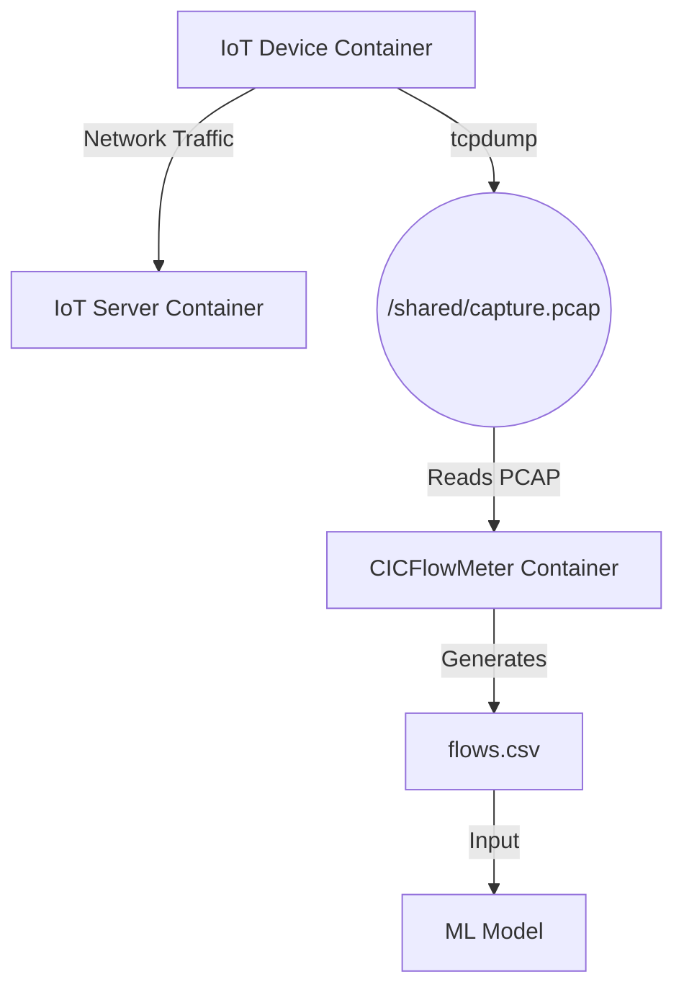

# IoT Network Traffic Analysis Pipeline

This project establishes a containerized pipeline for capturing, processing, and analyzing IoT network traffic in real-time. It captures raw packet data from an IoT device, converts it into flow-based features using CICFlowMeter, and prepares it for Machine Learning inference.

## 🏗 Architecture

The pipeline consists of the following data flow:

🔄 Workflow Description
Traffic Generation: The iot_device container communicates with the iot_server.

Packet Capture: tcpdump runs continuously inside the device container, writing PCAP chunks to a shared volume (/shared/capture.pcap).

Feature Extraction: The flow_meter container monitors the shared PCAP file. It reads new chunks repeatedly and converts raw packets into flow features.

ML Ingestion: The resulting flows.csv is consumed by the Machine Learning model for classification/anomaly detection.

To confirm real application data is being transmitted:

docker exec -it iot_device tcpdump -nn -r /shared/capture.pcap | grep "Flags \[P"
